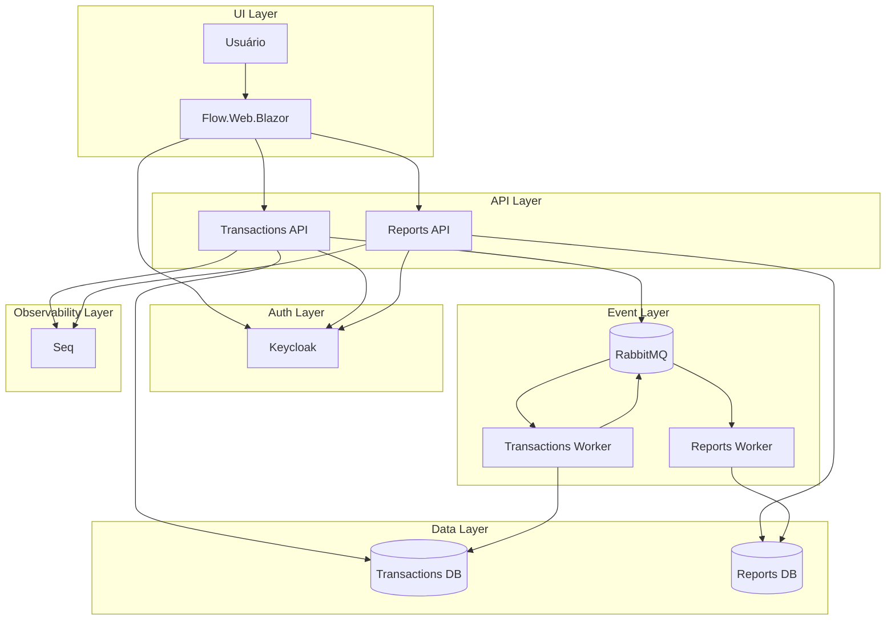
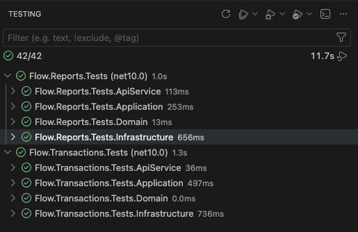

# Flow Case - Michel Oliveira

Projeto desenvolvido como um case técnico de arquitetura de software, com foco em boas práticas de engenharia, Clean Code, Clean Architecture, SOLID, Domain-Driven Design tático, separação de responsabilidades, testabilidade e baixo acoplamento. A solução atende ao cenário de um comerciante que precisa registrar lançamentos de débito e crédito e consultar o saldo diário consolidado.

A aplicação foi implementada em C# com .NET Aspire, usando uma arquitetura distribuída com dois microsserviços principais, comunicação orientada a eventos, use cases explícitos, persistência isolada por contexto e projetos compartilhados apenas para contratos e abstrações comuns.

## Autoria e rastreabilidade

Este projeto é de autoria de [micheloliveira-com](https://github.com/micheloliveira-com). Todo o histórico de desenvolvimento pode ser auditado no repositório público, a partir do commit da POC inicial: [8f67daaa7825bcc399ef2b3f7f336c8f61282417](https://github.com/micheloliveira-com/flow-case/commit/8f67daaa7825bcc399ef2b3f7f336c8f61282417).

## Objetivos atendidos

- Controle de lançamentos financeiros por data, tipo, valor e descrição.
- Relatório de saldo diário consolidado.
- Independência operacional entre o serviço de lançamentos e o serviço de relatórios.
- Integração assíncrona via RabbitMQ para reduzir acoplamento e preservar disponibilidade.
- Orquestração local com .NET Aspire, incluindo containers, service discovery, health checks, logs e observabilidade.
- Centralização de logs estruturados em Seq durante a execução.
- Autenticação com Keycloak e OIDC.
- Persistência separada por contexto usando PostgreSQL.
- Testes automatizados para domínio, aplicação e infraestrutura.
- Documentação arquitetural com ADRs.

Veja as [Imagens do sistema](docs/image/images.md)

## Visão da arquitetura

Além da visão resumida abaixo, os diagramas C4 completos estão disponíveis em [docs/architecture](docs/architecture):

| Diagrama | Descrição |
| --- | --- |
| [C4 - Arquitetura](docs/architecture/c4-architecture-diagram.md) | Visão unificada do sistema contendo Contexto e Containers, com diagramas e Structurizr DSL embutido. |



## Componentes

| Componente | Responsabilidade |
| --- | --- |
| `Flow.Aspire.AppHost` | Orquestra a aplicação distribuída localmente com Aspire. Sobe Web, APIs, RabbitMQ, Keycloak, PostgreSQL, pgAdmin e Seq. |
| `Flow.Web.Blazor` | Interface web para lançamentos e consulta de saldo diário. Existe para validar os fluxos funcionais do case, mas não foi o principal foco arquitetural da solução. |
| `Flow.Transactions.ApiService` | API de controle de lançamentos. Expõe CRUD de transações e publica eventos de recomputação diária. |
| `Flow.Reports.ApiService` | API de relatórios. Consulta o saldo diário consolidado materializado. |
| `Seq` | Centraliza logs estruturados das APIs durante a execução. |
| `Flow.Transactions.*` | Camadas de domínio, aplicação, infraestrutura e testes do contexto de lançamentos. |
| `Flow.Reports.*` | Camadas de domínio, aplicação, infraestrutura e testes do contexto de relatórios. |
| `Flow.Shared.*` | Contratos e abstrações compartilhadas entre os serviços. |

## Decisões arquiteturais

As decisões formais estão documentadas em [docs/adr](docs/adr).

### Registros de Decisão Arquitetural

Este repositório contém as decisões arquiteturais do projeto.

| ADR | Decisão | Status |
| --- | --- | --- |
| [ADR-0001](docs/adr/0001-usar-dotnet-aspire.md) | Usar .NET Aspire como AppHost e orquestrador local | Aceita |
| [ADR-0002](docs/adr/0002-dividir-em-dois-microsservicos.md) | Dividir a solução em dois microsserviços | Aceita |
| [ADR-0003](docs/adr/0003-comunicacao-orientada-a-eventos-com-rabbitmq.md) | Usar comunicação orientada a eventos com RabbitMQ | Aceita |
| [ADR-0004](docs/adr/0004-clean-architecture-ddd-e-use-cases.md) | Organizar os contextos com Clean Architecture, DDD tático e use cases | Aceita |
| [ADR-0005](docs/adr/0005-persistencia-separada-por-servico.md) | Manter persistência separada por serviço | Aceita |
| [ADR-0006](docs/adr/0006-keycloak-oidc-jwt.md) | Usar Keycloak, OIDC e JWT para autenticação | Aceita |
| [ADR-0007](docs/adr/0007-observabilidade-com-seq.md) | Usar Seq para logs estruturados no ambiente | Aceita |

## Fluxo funcional

1. O usuário cria, altera ou remove um lançamento no serviço `Transactions`.
2. A transação é persistida no banco do contexto de lançamentos.
3. O serviço publica uma mensagem `transaction-daily-recompute` com a data afetada.
4. Um worker do próprio contexto de lançamentos consome essa mensagem, recalcula o saldo do dia a partir da fonte transacional e publica `transaction-daily-balance`.
5. O serviço `Reports` consome o saldo consolidado e atualiza sua própria projeção de leitura.
6. A consulta de saldo diário lê diretamente do banco de relatórios.

Esse desenho evita que a indisponibilidade temporária do consolidado diário bloqueie o registro de novos lançamentos.

## Requisitos não funcionais

### Escalabilidade

- APIs e workers podem ser escalados horizontalmente.
- RabbitMQ absorve picos e desacopla escrita transacional de consolidação.
- Leitura de relatórios usa modelo materializado, evitando recomputar saldos a cada consulta.
- Redis não foi utilizado nesta versão porque o requisito de carga informado para o consolidado diário é de 50 requisições por segundo, volume que pode ser atendido pela projeção materializada em PostgreSQL e pelo desacoplamento assíncrono via RabbitMQ sem adicionar um componente operacional extra.

### Resiliência

- O serviço de lançamentos continua operando mesmo que o serviço de relatórios esteja indisponível.
- Consumidores usam confirmação manual (`ack`) e reprocessamento com `nack` em caso de falha.
- Os projetos executáveis usam `Flow.Aspire.ServiceDefaults`, que habilita a resiliência padrão do Aspire para `HttpClient`, incluindo handlers padrão de retry, timeout e reconnect/service discovery nas integrações suportadas.
- Health checks, dashboard Aspire e logs estruturados no Seq facilitam diagnóstico.
- Cada serviço possui seu próprio banco, reduzindo acoplamento operacional.

### Segurança

- Frontend autentica usuários via Keycloak e OIDC.
- APIs usam JWT Bearer emitido pelo Keycloak.
- Política padrão exige usuário autenticado nas APIs.
- Em produção, as configurações de desenvolvimento devem ser substituídas por HTTPS obrigatório, secrets externos e hardening de roles/scopes.

### Confiabilidade e consistência

- O modelo é eventualmente consistente: lançamentos são confirmados primeiro; o saldo diário é atualizado de forma assíncrona.
- O consumidor de relatórios ignora mensagens antigas quando já existe uma consolidação mais recente para a data.
- Para produção, os próximos passos naturais seriam implementar Outbox Pattern, mensagens persistentes, DLQ, retry com backoff, métricas de atraso de fila e testes de carga para validar o alvo de 50 requisições por segundo com perda máxima de 5%.

## Estrutura do repositório

```text
src/
  Flow.Aspire/
    Flow.Aspire.AppHost/
    Flow.Aspire.ServiceDefaults/
  Flow.Transactions/
    Flow.Transactions.ApiService/
    Flow.Transactions.Application/
    Flow.Transactions.Domain/
    Flow.Transactions.Infrastructure/
    Flow.Transactions.Tests/
  Flow.Reports/
    Flow.Reports.ApiService/
    Flow.Reports.Application/
    Flow.Reports.Domain/
    Flow.Reports.Infrastructure/
    Flow.Reports.Tests/
  Flow.Shared/
    Flow.Shared.Application.Abstractions/
    Flow.Shared.Infrastructure.Abstractions/
  Flow.Web/
    Flow.Web.Blazor/
```

## Pré-requisitos

- .NET SDK compatível com `net10.0`.
- Docker Desktop ou runtime Docker equivalente.
- Git.
- Portas locais livres para os recursos do Aspire, incluindo Keycloak, RabbitMQ, PostgreSQL, Seq e aplicações web.

## Como executar localmente

Restaure os pacotes:

```bash
dotnet restore src/Flow.slnx
```

Execute o AppHost do Aspire:

```bash
dotnet run --project src/Flow.Aspire/Flow.Aspire.AppHost/Flow.Aspire.AppHost.csproj
```

Ao iniciar, o Aspire exibirá no terminal a URL do dashboard. Pelo dashboard é possível acessar:

- `webfrontend`: aplicação Blazor.
- `transactionsapiservice`: API de lançamentos.
- `reportsapiservice`: API de relatórios.
- Keycloak, RabbitMQ, PostgreSQL, pgAdmin e Seq.

O AppHost também executa as migrations dos bancos automaticamente na inicialização das APIs.

## Artefatos e deploy

O projeto ainda não está configurado para deploy em Kubernetes. Para uma evolução de produção, o AppHost do .NET Aspire poderia ser preparado para geração de artefatos e deployment seguindo o fluxo oficial: [aspire.dev/deployment/kubernetes](https://aspire.dev/deployment/kubernetes/).

Nesse cenário, os comandos principais seriam:

```bash
aspire publish
aspire deploy
```

O comando `aspire publish` gera os artefatos necessários para implantação, enquanto `aspire deploy` aplica o deployment no ambiente configurado. Essa configuração também poderia compor uma estratégia de Infrastructure as Code, com manifests versionados e empacotamento via Helm para parametrização por ambiente.

## Login local

O realm do Keycloak é importado a partir de `src/Flow.Aspire/Flow.Aspire.AppHost/Realms`.

Usuário de teste:

```text
usuário: test
senha: test
```

Credenciais administrativas locais do Keycloak configuradas no AppHost:

```text
usuário: admin
senha: admin
```

Essas credenciais existem apenas para ambiente local do case técnico e não devem ser usadas em produção.

## Endpoints principais

As APIs estão protegidas por autenticação OIDC/JWT via Keycloak. Para chamadas diretas aos endpoints, é necessário seguir o fluxo de autenticação, obter um token válido e enviá-lo no header HTTP:

```http
Authorization: Bearer <access_token>
```

Para simplificar a validação funcional do case, o projeto inclui o frontend `Flow.Web.Blazor`, com autenticação integrada ao Keycloak e uma interface mínima para criação, edição, remoção e consulta de lançamentos, além da consulta do saldo diário consolidado. Pelo frontend, o login é feito pelo fluxo OIDC e o token é encaminhado automaticamente para as APIs.

O frontend Blazor foi incluído como interface operacional para demonstrar e validar os fluxos ponta a ponta. O foco principal de arquitetura, separação de responsabilidades e testes automatizados esteve nos contextos `Transactions`, `Reports`, mensageria, persistência, autenticação e observabilidade. Por isso, a UI pode conter limitações ou bugs de experiência que não invalidam o desenho arquitetural central do case.

### Transactions API

| Método | Rota | Descrição |
| --- | --- | --- |
| `GET` | `/transactions` | Lista lançamentos. Aceita filtros `start` e `end`. |
| `POST` | `/transactions` | Cria um lançamento. |
| `PUT` | `/transactions/{id}` | Atualiza um lançamento. |
| `DELETE` | `/transactions/{id}` | Remove um lançamento. |

Exemplo de criação:

```json
{
  "amount": 100.50,
  "type": 2,
  "date": "2026-05-24",
  "description": "Venda no crédito"
}
```

Tipos de transação:

| Valor | Tipo |
| --- | --- |
| `1` | Débito |
| `2` | Crédito |

### Reports API

| Método | Rota | Descrição |
| --- | --- | --- |
| `GET` | `/transaction_daily_balance` | Lista saldos diários consolidados. Aceita filtros `start` e `end`. |

## Como executar os testes

Execute os testes dos contextos de negócio presentes na solution:

```bash
dotnet test src/Flow.slnx
```

Executar testes por contexto, incluindo o AppHost Aspire:

```bash
dotnet test src/Flow.Transactions/Flow.Transactions.Tests/Flow.Transactions.Tests.csproj
dotnet test src/Flow.Reports/Flow.Reports.Tests/Flow.Reports.Tests.csproj
```

Os testes de `Transactions` e `Reports` cobrem regras de domínio, casos de uso, repositórios, publicadores e consumidores.



## Observabilidade e operação

O projeto usa os `ServiceDefaults` do Aspire para configurar endpoints padrão, health checks, logs, OpenTelemetry, service discovery e resiliência padrão de `HttpClient`. Essa configuração inclui `AddStandardResilienceHandler()` e `AddServiceDiscovery()`, habilitando comportamentos padrão de retry, timeout e reconnect/service discovery nas chamadas HTTP e integrações suportadas pelo Aspire.

Além disso, o AppHost provisiona um recurso `seq` para centralizar logs estruturados das APIs.

Durante a execução local, o dashboard do Aspire centraliza:

- Status dos recursos.
- Logs por serviço.
- Endpoints HTTP.
- Variáveis e conexões provisionadas pelo Aspire.
- Dependências entre recursos.

O Seq aparece como um recurso no dashboard do Aspire. Pelo endpoint exposto ali é possível abrir a interface do Seq e consultar eventos de log emitidos por:

- `transactionsapiservice`
- `reportsapiservice`

As APIs se conectam ao recurso por meio de `builder.AddSeqEndpoint(connectionName: "seq")`. No AppHost, o Seq é configurado com lifetime persistente para preservar dados locais entre execuções e com `ExcludeFromManifest`, pois a integração atual foi pensada para a experiência do case técnico. Em produção, a estratégia de observabilidade deveria ser definida explicitamente no ambiente de deploy, incluindo retenção, segurança, volume esperado, dashboards e alertas.

## Evoluções recomendadas para produção

- Implementar Outbox Pattern no serviço de lançamentos para garantir atomicidade entre persistência e publicação de eventos.
- Configurar mensagens persistentes, DLQ, retry com backoff e políticas de TTL no RabbitMQ.
- Definir `prefetch`, concorrência de consumidores e particionamento por data para suportar picos controlados.
- Adicionar testes de carga para validar 50 requisições por segundo no consolidado diário e medir perda, latência e atraso de fila.
- Adicionar métricas de negócio e operação: quantidade de lançamentos por minuto, lag da fila, falhas de consumo, tempo de consolidação e disponibilidade por serviço.
- Definir política de observabilidade produtiva para logs estruturados, métricas, traces, retenção e alertas.
- Externalizar secrets com cofre de segredos.
- Separar configurações de desenvolvimento, homologação e produção.
- Aplicar políticas mais granulares de autorização por role/scope.
- Criar pipeline CI/CD com build, testes, análise estática e publicação de imagens.

## Resumo

A solução privilegia disponibilidade, baixo acoplamento e clareza de domínio. O serviço de lançamentos permanece como fonte transacional, enquanto o serviço de relatórios mantém uma projeção otimizada para leitura. O uso de eventos permite evoluir os contextos separadamente e atende ao requisito crítico de não indisponibilizar o controle de lançamentos quando o consolidado diário falhar.
