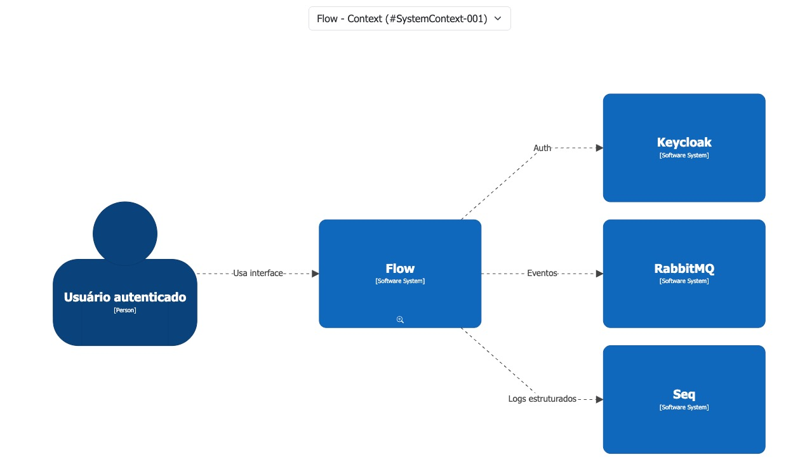
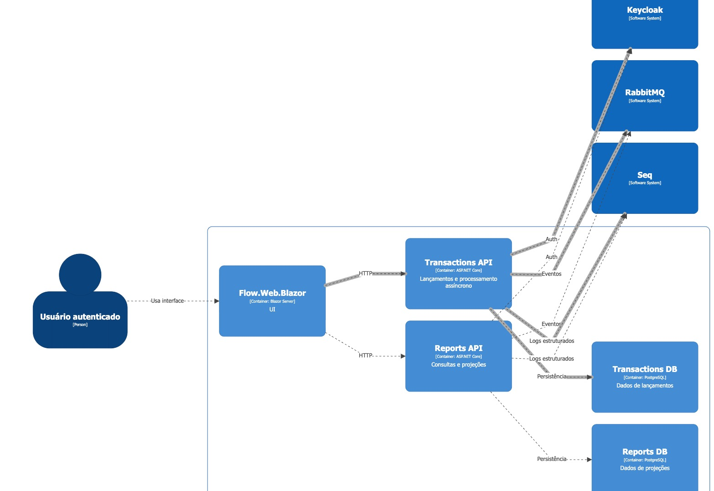

# C4 – Flow (Contexto + Containers)

## Visão geral

O sistema **Flow** é uma plataforma distribuída para controle de lançamentos financeiros e consolidação de saldo diário. Ele foi desenhado com separação clara entre interface, serviços de domínio, persistência, processamento assíncrono baseado em eventos e observabilidade.

A arquitetura segue um modelo orientado a eventos, com processamento desacoplado via mensageria, projeções materializadas para consultas e logs estruturados centralizados em Seq durante a execução.

---

## C4 Model (Structurizr DSL)

## Context Diagram



## Container Diagram




## Diagrama

<details>
<summary>Ver Structurizr DSL</summary>

````text
workspace "Flow" "Distributed transaction system" {

    model {

        user = person "Usuário autenticado"

        keycloak = softwareSystem "Keycloak"
        rabbitmq = softwareSystem "RabbitMQ"
        seq = softwareSystem "Seq"

        flow = softwareSystem "Flow" {

            web = container "Flow.Web.Blazor" "UI" "Blazor Server"

            transactionsApi = container "Transactions API" "Lançamentos e processamento assíncrono" "ASP.NET Core"

            reportsApi = container "Reports API" "Consultas e projeções" "ASP.NET Core"

            transactionsDb = container "Transactions DB" "Dados de lançamentos" "PostgreSQL"

            reportsDb = container "Reports DB" "Dados de projeções" "PostgreSQL"
        }

        user -> web "Usa interface"

        web -> transactionsApi "HTTP"
        web -> reportsApi "HTTP"

        transactionsApi -> keycloak "Auth"
        reportsApi -> keycloak "Auth"

        transactionsApi -> transactionsDb "Persistência"
        reportsApi -> reportsDb "Persistência"

        transactionsApi -> rabbitmq "Eventos"
        reportsApi -> rabbitmq "Eventos"

        transactionsApi -> seq "Logs estruturados"
        reportsApi -> seq "Logs estruturados"
    }

    views {

        systemContext flow {
            include *
            autolayout lr
            title "Flow - Context"
        }

        container flow {
            include *
            autolayout lr
            title "Flow - Containers"
        }

        theme default
    }
}
````

</details>

---

## Contexto do sistema

O usuário autenticado interage com o sistema Flow através de uma aplicação web Blazor. Todas as operações passam por autenticação centralizada via Keycloak utilizando OIDC/JWT.

O sistema depende de três componentes externos principais:

- **Keycloak**: responsável por autenticação e autorização.
- **RabbitMQ**: utilizado como broker para comunicação assíncrona entre serviços.
- **Seq**: utilizado para consulta centralizada de logs estruturados no ambiente.

O PostgreSQL é utilizado como persistência principal, separada por contexto.

---

## Containers

### Flow.Web.Blazor
Interface do usuário responsável por autenticação e interação com APIs.

### Transactions API
Responsável pelo ciclo de vida dos lançamentos financeiros (write model).

### Reports API
Responsável pelas consultas e projeções (read model).

### Transactions DB
Armazena dados transacionais.

### Reports DB
Armazena projeções de leitura.

### Seq
Centraliza logs estruturados emitidos pelas APIs durante a execução pelo AppHost Aspire.

---

## Fluxo de comunicação

1. Usuário acessa a Web.
2. Web autentica via Keycloak.
3. Web consome Transactions API e Reports API via HTTP.
4. Transactions API persiste dados e publica eventos.
5. Reports API consome eventos e atualiza projeções.
6. Consultas são realizadas no Reports DB.
7. Transactions API e Reports API enviam logs estruturados para o Seq.

---

## Decisões arquiteturais

- Autenticação centralizada no Keycloak (OIDC/JWT).
- Separação entre write model (Transactions) e read model (Reports).
- Comunicação assíncrona via RabbitMQ.
- Bancos separados por contexto.
- Consistência eventual nas projeções.
- Observabilidade com logs estruturados no Seq.
