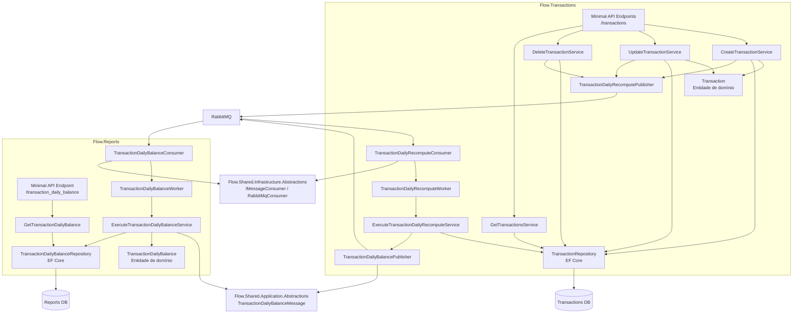

# C4 - Componentes

Este diagrama apresenta os principais componentes internos dos microsserviços `Transactions` e `Reports`, seguindo Clean Architecture, use cases explícitos e separação entre domínio, aplicação, infraestrutura e API.

## Leitura arquitetural

- A camada de API faz composição, autenticação, endpoints e workers.
- A camada de aplicação concentra os casos de uso.
- A camada de domínio concentra entidades e invariantes.
- A camada de infraestrutura implementa persistência e mensageria.
- Projetos compartilhados carregam apenas contratos e abstrações necessárias para integração entre serviços.
