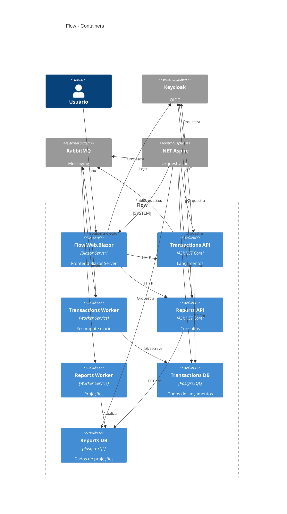

# C4 - Containers

Este diagrama apresenta os containers da solução, incluindo frontend, APIs, workers, bancos de dados e broker de mensagens.

## Decisões representadas

- O frontend Blazor evita chamadas manuais autenticadas durante o teste, pois integra login OIDC e encaminhamento de token.
- O serviço de lançamentos é independente do serviço de relatórios.
- O saldo diário consolidado é atualizado de forma assíncrona.
- Cada microsserviço possui sua própria base PostgreSQL.
- Redis não foi utilizado, pois o requisito de 50 requisições por segundo é atendido pela projeção materializada e pela mensageria.
