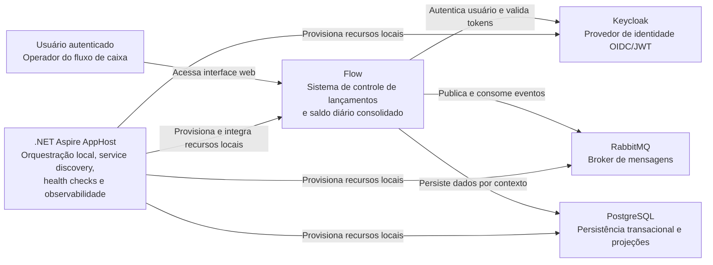

# C4 - Contexto

Este diagrama apresenta a solução no nível de contexto, mostrando o usuário, o sistema Flow e as principais dependências de plataforma usadas para autenticação, mensageria, persistência e orquestração local.

## Observações

- O sistema foi dividido em dois contextos principais: lançamentos e relatórios.
- A autenticação é centralizada no Keycloak com OIDC/JWT.
- A comunicação entre lançamentos e relatórios é assíncrona via RabbitMQ.
- O .NET Aspire é usado para simplificar a execução local da aplicação distribuída.
